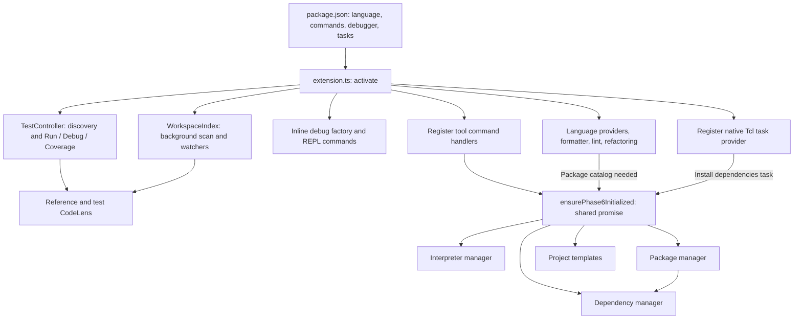
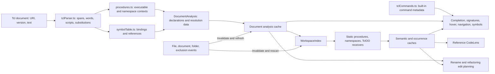
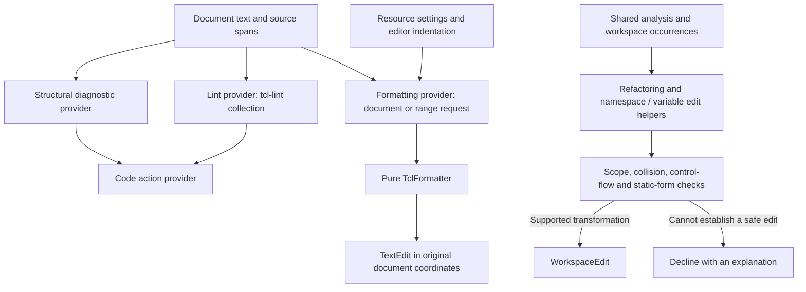
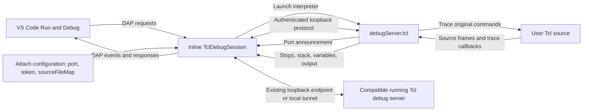
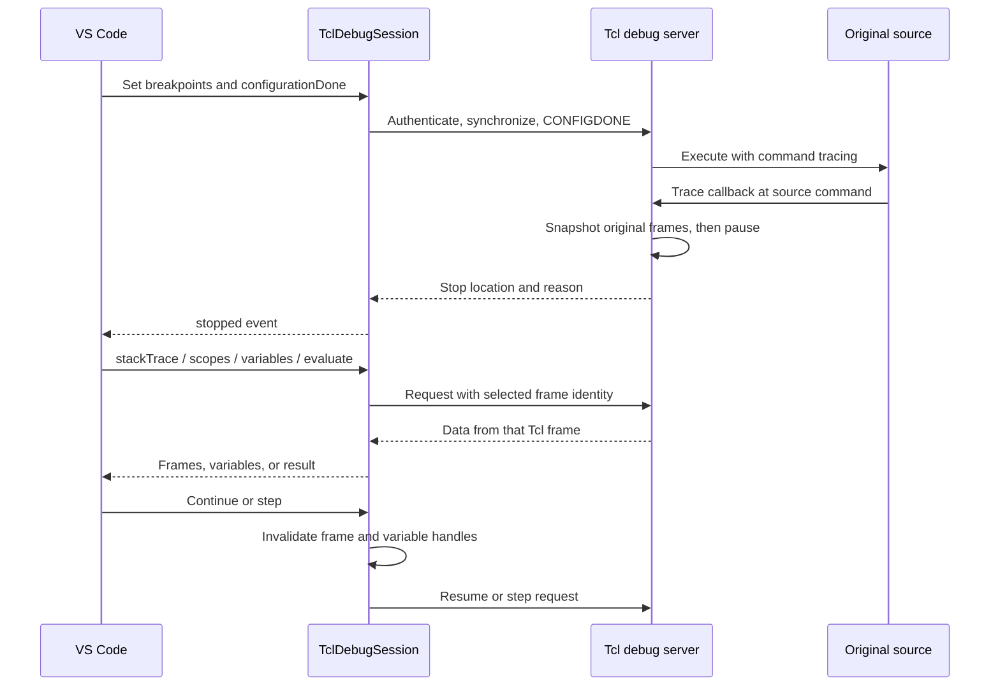
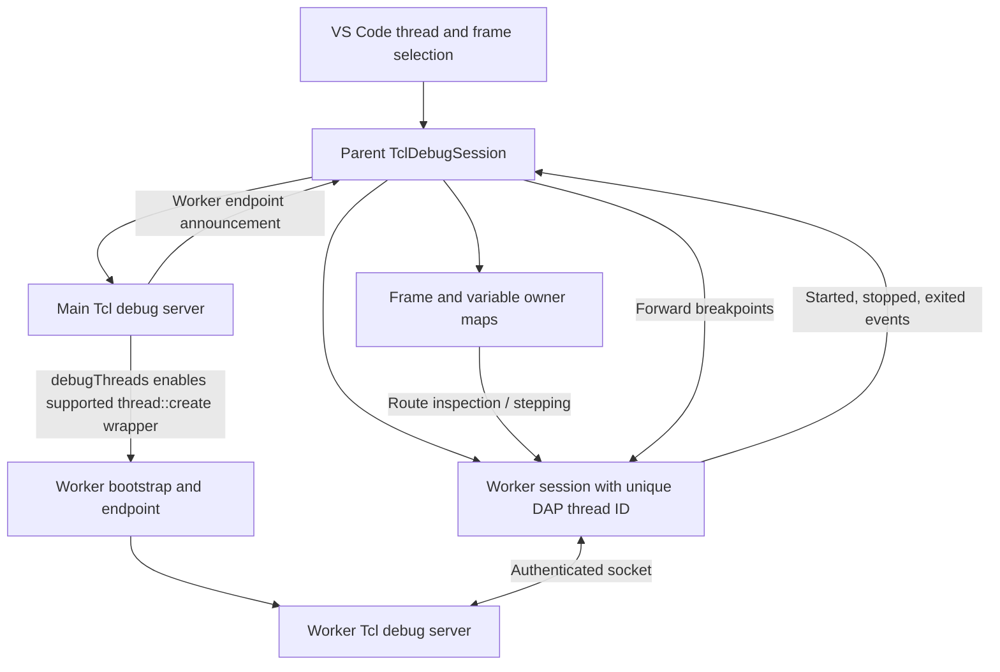
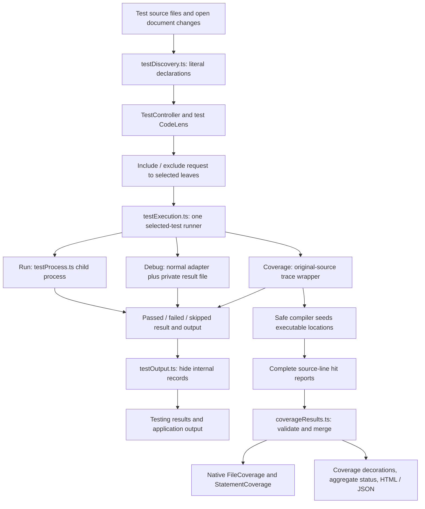
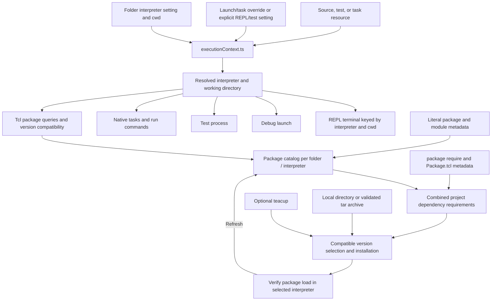
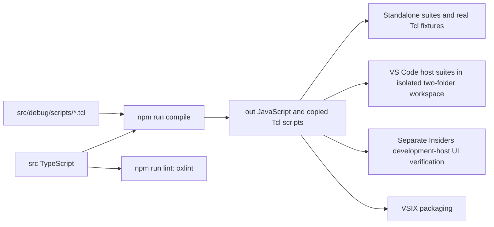
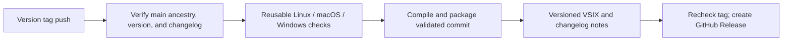

# Architecture diagrams

These diagrams describe TCL Language Support 0.8.0. Component names correspond to the implementation in `src/`. See [the architecture guide](ARCHITECTURE_GUIDE.md) for details and limitations.

## Activation and service ownership

Native task discovery and resolution are available before tool initialization. The lazy initialization promise is shared by simultaneous callers and reset after failed initialization. Extension subscriptions and explicit deactivation cleanup own the corresponding listeners, caches, terminals, processes, and sockets.

## Shared language analysis

Open document versions override disk-indexed data. The index watches `.tcl`, `.tk`, `.tm`, and `.test` files across workspace folders and honors configured exclusions. A separate `SymbolTableCache` preserves the scope-table interface for providers that use it.

Analysis follows known executable bodies and literal namespace/TclOO forms. Literal data, dynamic command generation, unresolved callbacks, and ambiguous receivers are not treated as proven symbol references.

## Formatting, diagnostics, and edits

Formatting distinguishes executable scripts and switch bodies from literal Tcl values. Refactoring checks must preserve scope and substitution semantics; they are not unrestricted text replacement.

## Debug launch and attach

Launch owns its interpreter process. Attach expects an already started compatible server, accepts loopback addresses, and uses an external tunnel for a remote target. Attach disconnect normally detaches; explicit termination can stop the target. `sourceFileMap` translates target/editor source prefixes.

Frame identity is retained for recursive calls and selected caller inspection. Stops distinguish entry, pause, step, and breakpoint reasons. Recognized scalar assignment continuations avoid an immediate duplicate stop; nested substitutions can still expose multiple command stops on one line.

## Optional Thread workers

Workers require the Tcl Thread package and creation through the instrumented path. The adapter does not discover arbitrary OS threads or workers that predate instrumentation. Each paused worker retains its own source frames and inspection handles.

## Selected tests and coverage

Selected tcltest runs suppress unselected test bodies; source-file top-level setup still executes. Procedure tests are called explicitly. Cancellation and timeouts belong to the runner process; debug cancellation targets the matching debug session. Coverage measures executable source lines in observed source files and does not promise branch coverage or whole-project discovery.

## Resource-aware tools and execution

Feature defaults do not override a selected project interpreter. Static package scanning does not source every project package; installation verification deliberately loads the requested package. Dynamic requirements remain unknown. Script tasks pass arguments as process arguments, and dependency installation tasks call the lazy dependency service through a custom execution.

## Build and validation flow

`npm run watch` watches TypeScript only; run `npm run compile` after Tcl debug-server edits. CI exercises standalone and host suites on Linux, macOS, and Windows. The Insiders UI report records a separate manual verification pass and its coverage limits; it is not an automatic consequence of a passing host test run.

## Tagged release flow

Tags outside main skip release jobs. The artifact publishing job alone has repository write permission. The [contributor guide](CONTRIBUTING.md) documents tag naming, version updates, and retry behavior.
